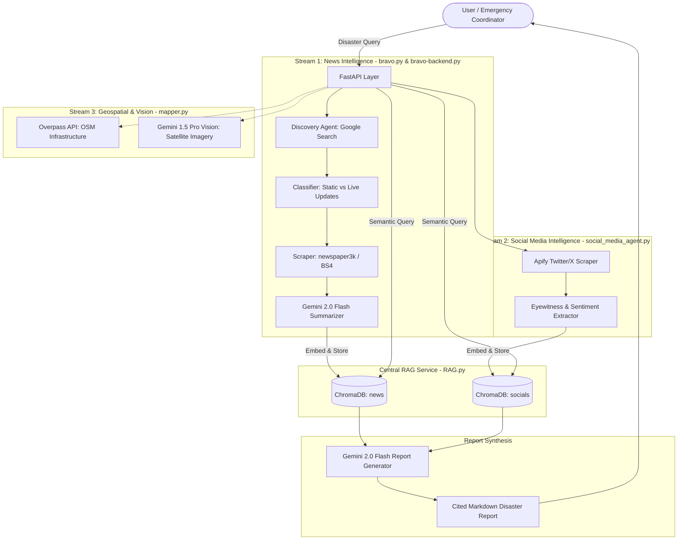

# Tri-Aid: Autonomous Multi-Agent Disaster Intelligence & Rapid Assessment Platform

An autonomous, multi-agent crisis response and intelligence system developed for the **MIT Global AI Hackathon (MIT GAH)**.

Tri-Aid ingests, cross-verifies, and synthesizes real-time multimodal data across **three crisis intelligence streams**:
1. **News & Web Intelligence:** Automated discovery, classification (live vs. static blogs), and web scraping of breaking disaster coverage.
2. **Social Media & Eyewitness Feeds:** Ingestion of eyewitness tweets, sentiment analysis, and LLM-driven misinformation detection.
3. **Geospatial & Satellite Vision:** OpenStreetMap infrastructure risk assessment and multimodal satellite imagery inspection for damage detection and evacuation corridors.

---

## 🏛️ Architecture Overview



---

## 🧩 Core Modules

| Module | Description | Port |
| :--- | :--- | :--- |
| **`RAG.py`** | Central vector database service managing ChromaDB collections (`news`, `socials`, `user_inputs`) with Ollama `nomic-embed-text` embeddings. | `8000` |
| **`bravo.py`** | Multi-agent news workflow built with Google ADK (`SequentialAgent`, `Runner`) orchestrating Discovery, Page Classification, and Scraping. | - |
| **`bravo-backend.py`** | Search-First, RAG-Second hybrid API that dynamically searches, summarizes, stores into ChromaDB, and compiles structured situation reports. | `8080` |
| **`social_media_agent.py`** | Apify-powered Twitter/X scraper extracting eyewitness reports, public sentiment, and urgent relief needs, with combined report synthesis. | `8081` |
| **`social_agent_api.py`** | FastAPI endpoints for social data ingestion and report generation. | `8081` |
| **`disaster_api.py`** | Standalone disaster reporting API service with synchronous RAG fact augmentation. | `8080` |
| **`mapper.py`** | Geospatial analytics module using OpenStreetMap Overpass API, OSMnx, and Gemini Multimodal Vision for damage and evacuation corridor analysis. | - |

---

## 🚀 Getting Started

### 1. Prerequisites
- Python 3.10+
- [Ollama](https://ollama.ai/) running locally with `nomic-embed-text` model:
  ```bash
  ollama pull nomic-embed-text
  ```

### 2. Installation
Clone the repository and install dependencies:
```bash
git clone https://github.com/DMalpani11/Tri-Aid-Disaster-Assessment-Platform.git
cd Tri-Aid-Disaster-Assessment-Platform
pip install -r requirements.txt
```

### 3. Environment Variables
Copy `.env.example` to `.env` and fill in your API credentials:
```bash
cp .env.example .env
```
Edit `.env`:
```env
GEMINI_API_KEY="your_gemini_api_key"
APIFY_API_TOKEN="your_apify_token"
RAG_SERVER_URL="http://localhost:8000"
```

---

## 🏃 Running the Services

### Start RAG Vector Service (Port 8000)
```bash
python RAG.py
```

### Start News Intelligence Backend (Port 8080)
```bash
python bravo-backend.py
```

### Start Social Media Intelligence API (Port 8081)
```bash
python social_agent_api.py
```

---

## 📄 Example Situation Report Generation
Send a POST request to generate a complete disaster report combining official news and eyewitness social feeds:

```bash
curl -X POST "http://localhost:8081/combined_report" \
     -H "Content-Type: application/json" \
     -d '{
       "event_name": "Kerala floods",
       "start_date": "2018-08-08",
       "end_date": "2018-08-17",
       "max_results": 10
     }'
```

---

## 📜 License
MIT License. Developed for educational, hackathon, and crisis management research purposes.
